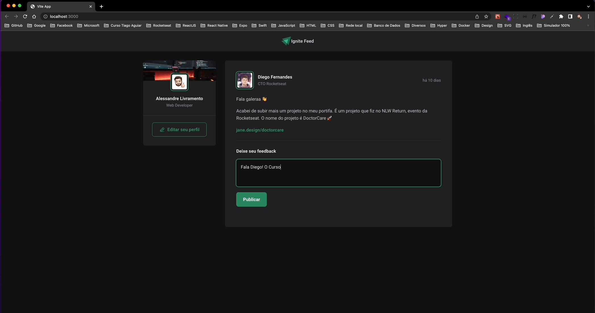

## 💻 Projeto

Ignite Feed é um projeto da trilha de fundamentos de React JS da Rocketseat.

## 🚀 Tecnologias utilizadas

- [Vite JS](https://vitejs.dev)
- [Date-fns](https://date-fns.org)
- [Typescript](https://www.typescriptlang.org)
- [Phosphor Icons](https://phosphoricons.com)

## 📄 License

Este projeto está sob a licença MIT
