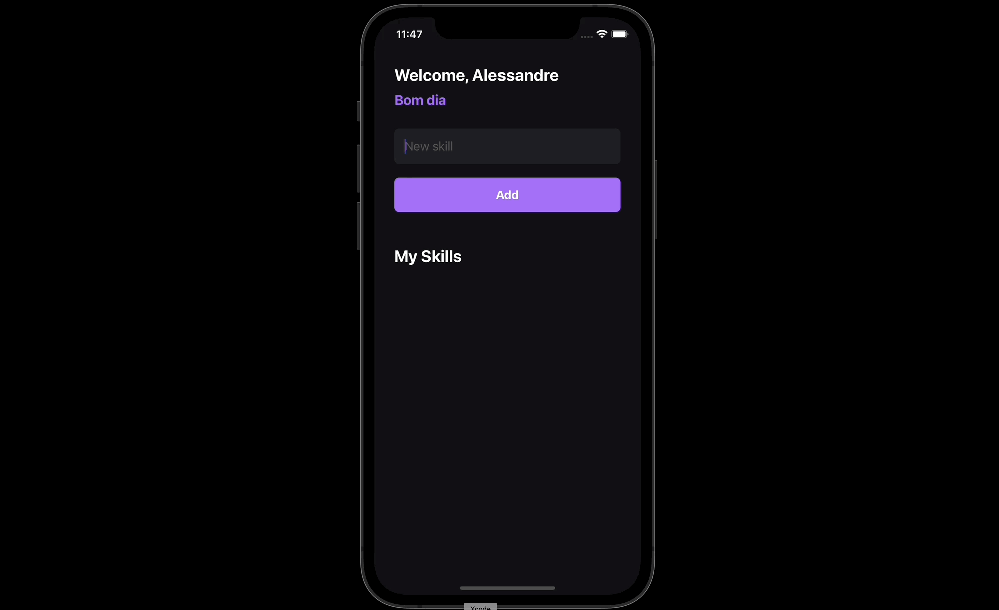

## 💻 Projeto

MySkills é um aplicativo desenvolvido no curso Ignite da Rocketseat.

## 🚀 Tecnologias utilizadas

- [TypeScript](https://www.typescriptlang.org/)
- [React native](https://reactnative.dev)

## 📄 License

Este projeto está sob a licença MIT
